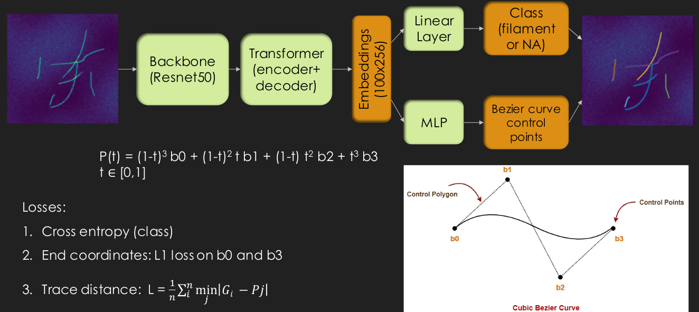

# TraceNet

Network for filament detection based on [Detection Transformer (DETR)](https://github.com/facebookresearch/detr).

Run the training with [train.py](train.py).

Generate LSF cluster commands wit [generate_bsub.ipynb](generate_bsub.ipynb).

Evaluate the accuracy of the model with [evaluate_accuracy.ipynb](evaluate_accuracy.ipynb).
